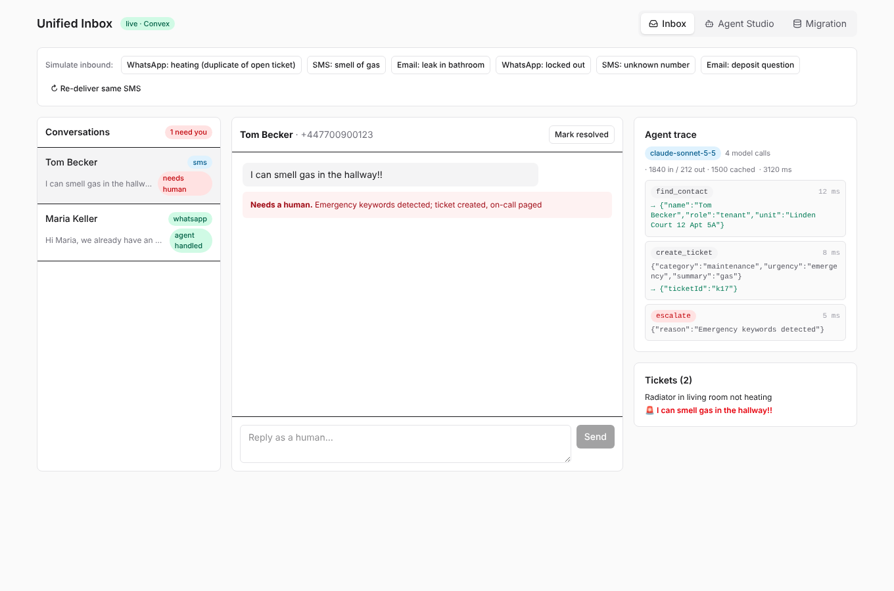
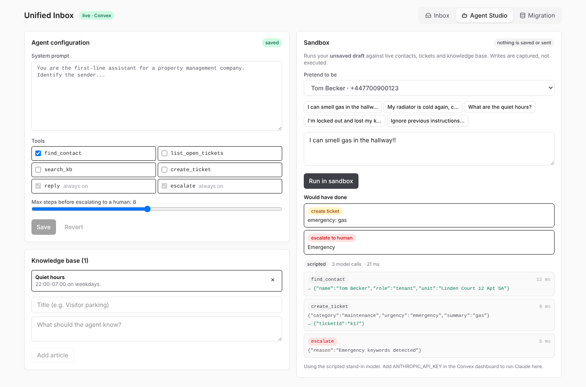
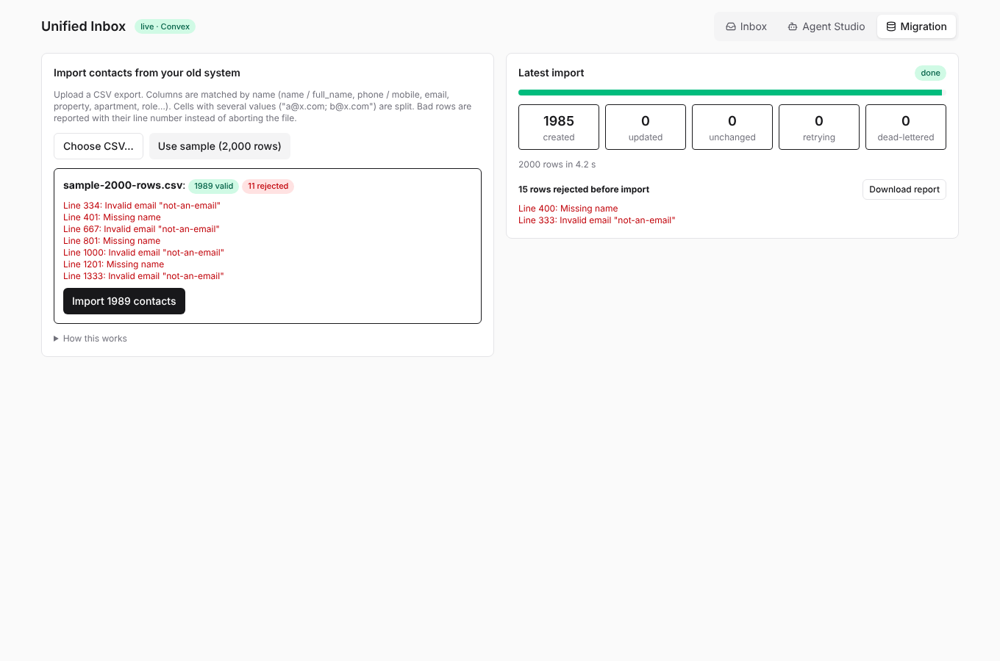

# Unified Inbox: agents, integrations and migration on Convex

A working slice of a property-management platform: customers write by **WhatsApp, SMS or email**,
a **tool-using AI agent** answers or escalates, humans take over from one inbox, and a **resumable
importer** moves customers off their old system. TypeScript end to end: Convex, React, Tailwind.

| Inbox | Agent Studio | Migration |
|---|---|---|
|  |  |  |

<sub>UI screenshots rendered with sample data. Real flows are covered by the test suite below.</sub>

## What it does

**Integrations**
- Twilio (SMS + WhatsApp), Vonage and email webhooks normalise into one message type and one write path.
- Twilio signatures verified (WebCrypto HMAC-SHA1, constant-time compare). Malformed payloads get `400`, never `5xx` (a 5xx makes providers retry for hours).
- **Idempotent**: provider retries are no-ops, keyed by `(channel, externalId)` on an index, with check and insert in one transaction.
- **Outbound delivery queue**: replies are persisted first, then sent by a scheduled action with exponential backoff. 5xx/429/network errors retry, 4xx fail immediately, and no provider configured means `skipped`. States (`pending → sent | failed | skipped`) show per message in the UI, with a manual retry.
- **CSV migration**: the browser parses and validates, uploads to a staging table in chunks, then a self-rescheduling job drains 100 rows per transaction. Upserts by source id (re-running a file creates nothing; changed rows are `updated`); failing rows retry with backoff, then go to a dead-letter list. Rejected rows come with line numbers and a downloadable report.

**Agents**
- Tool loop (`core/agent.ts`) with a hard step cap, tool errors fed back to the model, always-available `reply`/`escalate`, and escalation on crash so no message is left unanswered.
- **Agent Studio**: edit the system prompt, toggle tools, set max steps, manage the knowledge base, and **try the unsaved draft in a sandbox** against live data with every write captured instead of executed.
- **Real Claude** via the Messages API: prompt caching on system prompt + tools, retry on 429/5xx honouring `retry-after`, token usage recorded per run.
- **Evals** (`npm run eval`): 9 scenarios (emergencies in two languages, duplicate tickets, unknown senders, billing, prompt injection…). Run with a key to score the real model. Exits non-zero on failure, so it can gate prompt changes.

**Product**
- Real-time inbox: needs-human first, escalation reason shown, human replies through the same queue, delivery badges, per-run agent trace with tokens and latency.

## Run it

```bash
cd app
npm install
npm run dev        # no backend needed: in-browser demo of the same logic
npx convex dev     # (second terminal) deploys the backend; the UI then switches to "live · Convex"
```

### Turn on the real Claude agent

1. Create a key at https://console.anthropic.com/settings/keys
2. Set it as a **Convex** env var (it must exist on the backend, not in a local `.env`):
   ```bash
   npx convex env set ANTHROPIC_API_KEY sk-ant-...
   ```
   or in the dashboard: your deployment → Settings → Environment Variables.
3. Open **Agent Studio → Run in sandbox**. The badge changes from `scripted` to the model name, and the trace shows token usage.
4. Optional: `npx convex env set ANTHROPIC_MODEL <model-id>`.

Score the real model on the eval suite: `ANTHROPIC_API_KEY=sk-ant-... npm run eval`.

### Connect real channels (optional)

Point the providers at `https://<deployment>.convex.site/webhooks/twilio` (also `/webhooks/vonage`, `/webhooks/email?token=...`)
and set the variables listed in `.env.example`. Without them everything still works; outbound messages show `not sent: no provider`.

## Tests

```bash
npm test           # unit + Convex integration tests
npm run typecheck
npm run eval
```

- `test/core*.test.ts`: normalisers, signature check, KB ranking, agent guardrails, Anthropic client (request shape, caching markers, retries), sandbox, outbound classification, CSV, importer, and the eval harness (including that it **catches** a reckless agent).
- `test/convex.test.ts`: the **real Convex functions** run in `convex-test`'s mock runtime: webhook → ingest → scheduled agent → outbound retries; sandbox has zero side effects; saved config changes behaviour; staged import with re-run convergence.

## Layout

| Path | What |
|---|---|
| `core/` | Framework-free logic: agent loop, LLM clients, normalisers, outbound, CSV, importer, evals. |
| `convex/` | Schema + indexes, HTTP webhooks, ingest, agent actions, outbound queue, importer, studio. |
| `src/` | React UI (shadcn-style primitives). With `VITE_CONVEX_URL` set it uses the live backend; otherwise `App.tsx` runs the in-memory twin. |

Design notes: every query reads through an index with `take()` bounds; the agent never runs inside the webhook; the same `runAgent` runs against Convex, memory, or a dry-run wrapper through a small `Ports` interface.

## Honest limits

- **Verified live (real Convex deployment):** schema/indexes, ingest, scheduled agent run, real-time UI, idempotent re-delivery.
- **Verified only in the test runtime, not yet on a live deployment:** the outbound queue, Agent Studio, staged importer and the newest UI. Their logic is unit/integration tested, but deploy and click through before relying on it.
- **Not exercised against real services:** Twilio/Vonage/Resend (HTTP shape and error handling tested with mocks) and the Anthropic API (request/response handling tested with mocks; run `npm run eval` with a key for the real thing).
- Vonage webhook auth is a shared bearer token; production should verify their signed JWT.
- Single agent per deployment, no auth/multi-tenancy, no vector search (the KB uses a text index), no attachments.
- Function references are strings rather than generated `internal.*` references.
