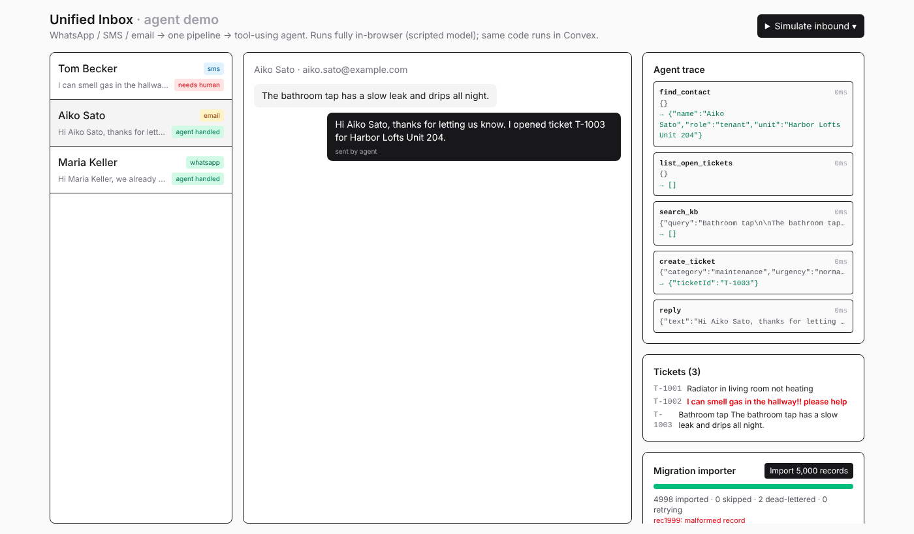

# Unified Inbox + Agent + Migration Importer

A small, working slice of the three areas in the job post: **Product** (inbox UI),
**Integrations** (Twilio / Vonage / email webhooks, bulk importer) and **Agents**
(tool-using agent with guardrails). TypeScript end to end: Convex, React, Tailwind.



## Run it

```bash
npm install
npm run dev      # demo UI, no keys or backend needed (scripted model runs in-browser)
npm test         # 14 tests on the core logic
npm run typecheck
```

Click **Simulate inbound** (WhatsApp, SMS, email), watch the agent trace, and hit
**Import 5,000 records** to see retries and dead-lettering.

## Layout

| Path | What |
|---|---|
| `core/` | Pure TypeScript, no framework. All the interesting logic, fully tested. |
| `convex/` | Thin Convex layer over `core/`: schema + indexes, HTTP webhooks, agent action, importer. |
| `src/` | React inbox UI. Demo mode drives the in-memory twin of the Convex tables (`core/store.ts`). |
| `test/` | Vitest. |

## Design decisions

**Integrations**
- Every channel normalizes to one `InboundMessage` (`core/normalize.ts`), then one write path (`convex/ingest.ts`).
- **Idempotent**: providers retry webhooks. Key is `(channel, externalId)` with an index; the check and insert happen in one Convex mutation, so concurrent retries can't both win.
- Twilio signature verified with WebCrypto HMAC-SHA1 and constant-time compare. Webhooks return fast; the agent runs via `scheduler.runAfter`, never inline.
- Email: display-name parsing and quoted-reply stripping.

**Importer** (`core/importer.ts`)
- Cursor-based, bounded batches so each tick fits a transaction; it reschedules itself until done, so a 500k-record import is a chain of short transactions.
- Idempotent upserts keyed by `sourceId`, so re-running is safe. Exponential backoff with jitter; poison records go to a dead-letter list instead of blocking the rest. A retried page doesn't redo or double-count settled rows.

**Agent** (`core/agent.ts`)
- Model-agnostic `Llm` interface; `anthropicLlm` (plain `fetch`, works in a Convex action) and a deterministic `scriptedLlm` for demo and tests.
- Tools hit a `Ports` interface, so the same loop runs against Convex or memory.
- Guardrails: hard step cap (then escalate), tool errors fed back to the model, unknown sender or emergency goes to a human, a crashed run escalates so no customer message is left unanswered, every step is recorded in `agentRuns`.

## Honest limits

- **The Convex layer typechecks but was not deployed or run**: I had no Convex account/network in the build environment. The logic it wraps is what's tested. Next step: `npx convex dev`, then run `codegen` and swap the string function refs (`"ingest:receive" as any`) for the generated `internal.*` references.
- The demo model is scripted, not an LLM. Set `ANTHROPIC_API_KEY` in Convex env to use the real one; I haven't exercised that path against the live API.
- Outbound sending (Twilio/Vonage/SMTP) is a marked TODO in `convex/agentTools.ts`; the importer adapter in `convex/importer.ts` is a stub.
- Vonage webhook auth is a shared bearer token; production should verify their signed JWT.
- KB search is BM25 in `core/kb.ts` for the demo; Convex uses a search index and would use a vector index in production.
- No shadcn/ui components yet; plain Tailwind.
